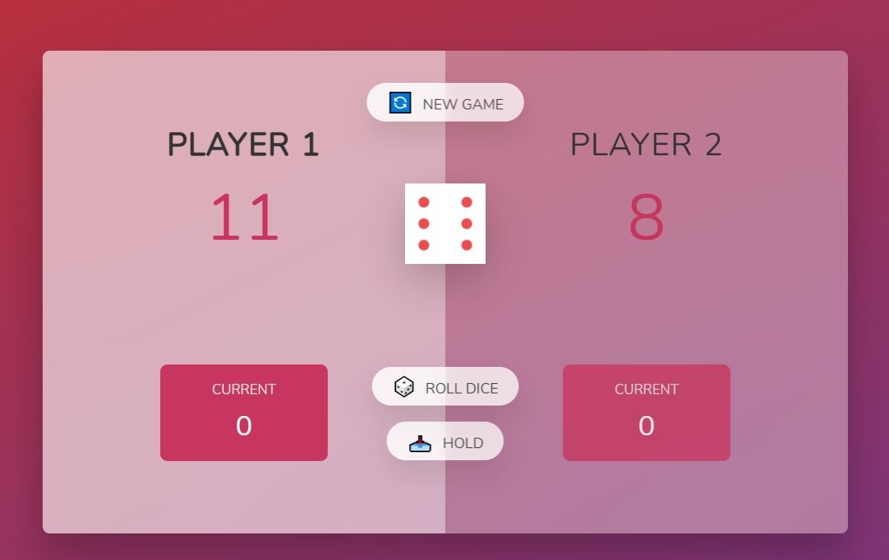

## Overview

Deployed Application: https://dchiev.github.io/Pig-Game/

Simple Javascript game featuring random dice scores and 2 player functionality.

## Table of Contents

- [Overview](#Overview)
- [Description](#Description)
- [Installation](#Installation)
- [Usage](#Usage)
- [License](#License)
- [Contributors](#Contributors)
- [GitHub](#GitHub)

## Description

Simple Javascript game featuring random dice scores and 2 player functionality.

## License

[MIT License](http://opensource.org/licenses/mit-license.php)

## Github Info

[Dan Chiev](https://github.com/dchiev),
